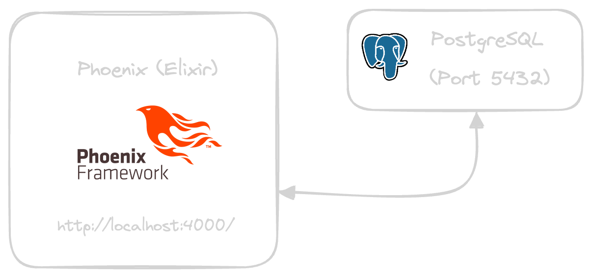
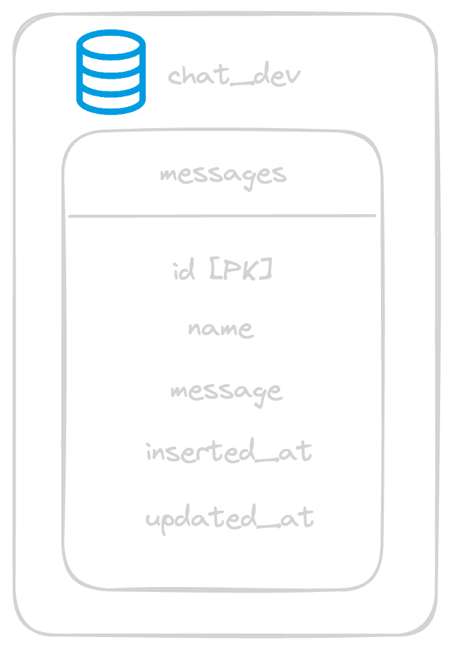

# Phoenix Chat

Try it: 
[https://hrg9mqpt-4000.uks1.devtunnels.ms/](https://hrg9mqpt-4000.uks1.devtunnels.ms/)

## What is Phoenix Chat?

This is a chat application, with optional authentication, where you can chat with other people instantly, using websockets ("channels") and implementing "CRUD" functions.

## Requirements

You must have installed the following technologies:

  * Elixir
  * Phoenix 
  * PostgreSQL

## Run the app locally

First and foremost, you need to have running a PostgreSQL service (in port 5432):

```sh
psql
```

And now you can start the app following with these steps:

  * Run `mix setup` to install and setup dependencies.
  * Start Phoenix endpoint with `mix phx.server`.

Now you can visit [`localhost:4000`](http://localhost:4000) from your browser.


## Architecture

### App architecture



### Database architecture

